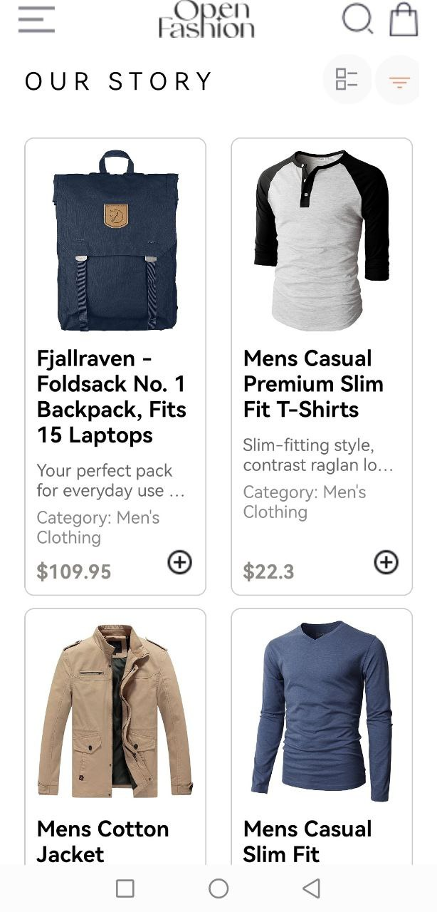
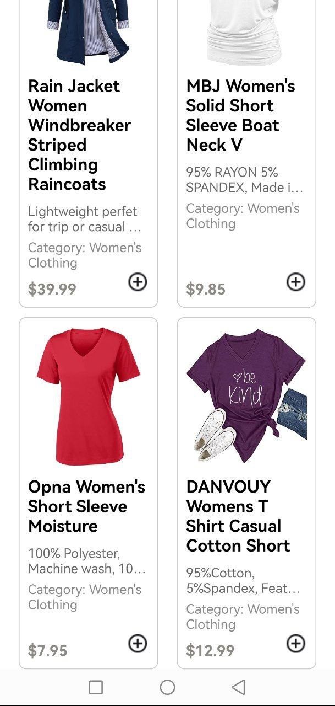
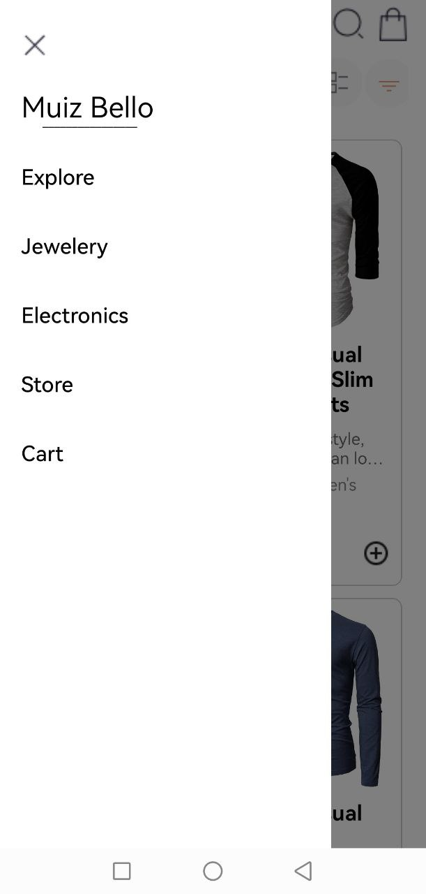
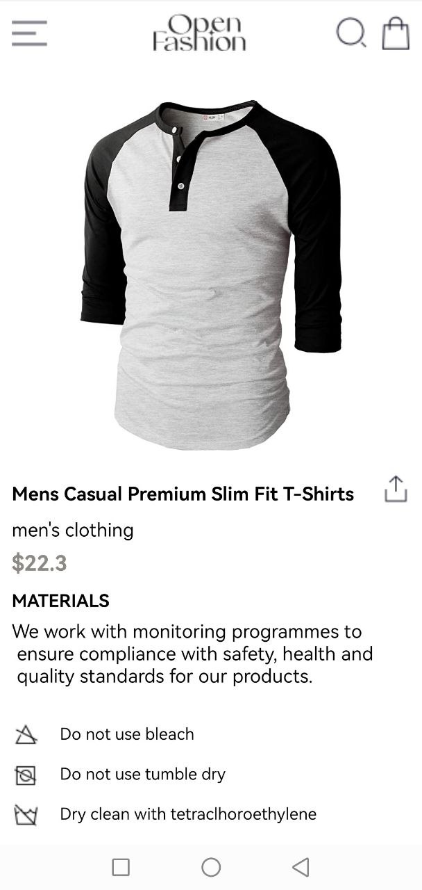
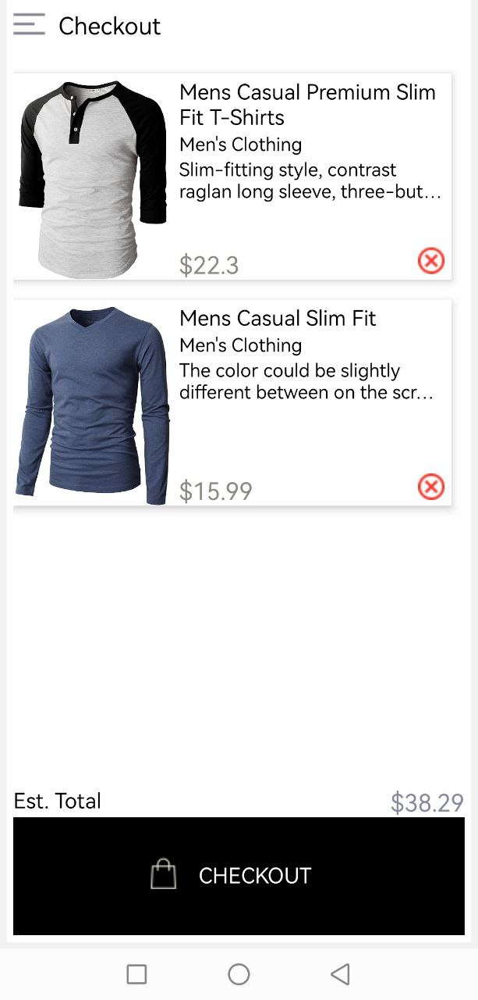
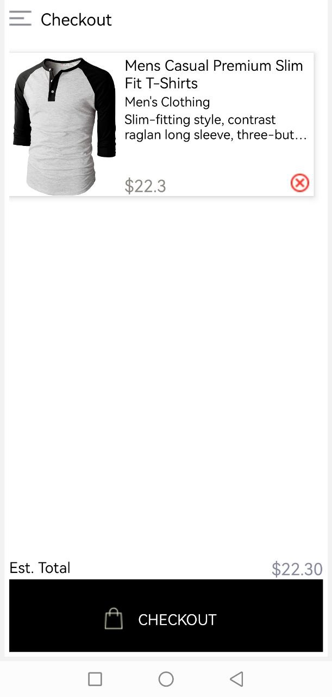

# rn-assignment7-11068463

## Project Description:

This is a react native project that models an e-commerce store. The products are retrieved from _fakestoreapi.com_ using react native's fetch function. The results are then parsed as JSOn and mapped into product cards. The product cards, when tapped take the user to a details page containing information such as handling and washing guidelines.

Each product card has an add to cart button, when clicked it triggers the _addTOCart_ function which adds the product details to an array and saves it locally using _AsyncStorage_. When the user routes to the cart screen the cart is fetched. On the cart screen ,a user can remove items which is implemented using Javascript's spread and splice functions.

The drawer uses react native's drawer navigator but changes the typical render to allow me to add the name and close button.

## Design:
Each product has a border to help organise the content.

On the cart screen, the product is displayed in a more landscape-oriented view.

## Screenshots

